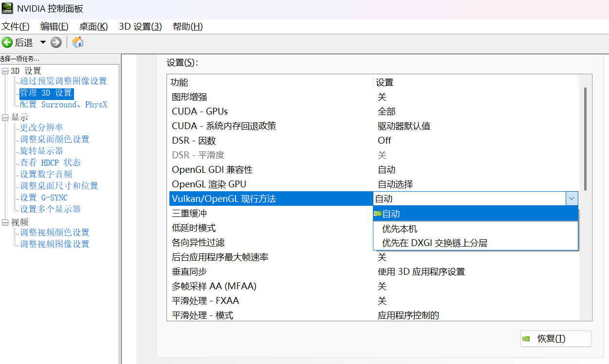
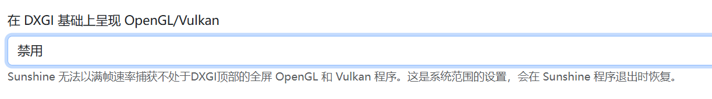

# DXGI 兼容模式

当在 Windows 11 21H2 以上版本使用 SPW，在【设置】->【外观】页面的【主题】选项卡的【样式】选项中选择了“亚克力”或者“云母”后发现窗口背景不正常，可以尝试启用“DXGI 兼容模式”。

::: warning 启用后的副作用（缺陷）
- 性能问题：启用“DXGI 兼容模式”后 SPW 的界面流畅度可能受到影响。
- 标题栏问题：启用“DXGI 兼容模式”后标题栏将不支持部分 Windows 窗体功能，如窗体停靠。
:::

若出现“亚克力”或者“云母”后窗口背景不正常的情况，可以先不启用“DXGI 兼容模式”而先尝试以下解决方法：

- 若使用 NVIDIA 显示卡，请在“NVIDIA 控制面板”应用程序的【3D 设置】->【管理 3D 设置】页面的选项列表中找到“Vulkan/OpenGL 现行方法”，如果选择了“优先在 DXGI 交换链上分层”，请尝试改成“自动”或“优先本机”并应用，然后重新启动 SPW。
  

- 若使用了 Sunshine 软件，请禁用下图中选项或者对 SPW 进行屏蔽，并在应用成功后重新启动 SPW。
  

以上方法可能并不能完全解决问题，当无效后再尝试启用“DXGI 兼容模式”，若依旧无法解决问题请提交反馈。